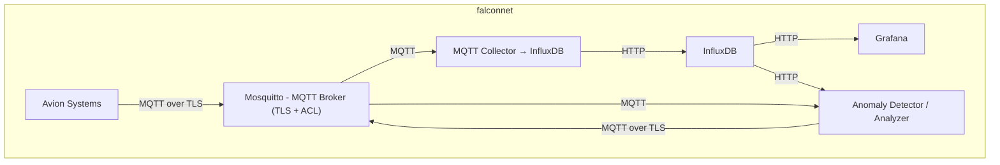

# FalconEye Avionics Simulation

FalconEye is a containerized avionics simulation environment. It simulates aircraft subsystems (navigation, flight control, hydraulics, engine, structure), publishes sensor data via MQTT over TLS with client authentication, stores the data in InfluxDB, analyzes it for anomalies, and visualizes it in Grafana dashboards.

---

## Architecture


```mermaid
graph TD
    subgraph falconnet
        avion["Avion Systems"]
        mqtt["Mosquitto - MQTT Broker (TLS + ACL)"]
        collector["MQTT Collector → InfluxDB"]
        influxdb["InfluxDB"]
        grafana["Grafana"]
        analyzer["Anomaly Detector / Analyzer"]
    end

    avion -->|MQTT over TLS| mqtt
    mqtt -->|MQTT| collector
    collector -->|HTTP| influxdb
    influxdb -->|HTTP| grafana

    mqtt -->|MQTT| analyzer
    influxdb -->|HTTP| analyzer

    analyzer -->|MQTT over TLS| mqtt

```

---

## Getting Started

### Prerequisites

- Docker & Docker Compose
- Git

### Installation

1. Clone the repository:

   ```bash
   git clone https://github.com/your-username/falconeye.git
   cd falconeye
   ```

2. Launch the infrastructure (build included):

   ```bash
   make up
   ```

3. Access Grafana at [http://localhost:3000](http://localhost:3000)\
   Default credentials:

   - **Username**: `admin`
   - **Password**: `adminpass`

   Same credentials apply to InfluxDB.

---

## Configuration Highlights

- All services run isolated in the `falconnet` Docker network.
- MQTT broker (`mosquitto`) is configured with:
  - TLS encryption using **ECDHE** cipher suites.
  - Client certificate authentication (mutual TLS).
  - Access Control Lists (ACLs) to restrict topic permissions per user.
- MQTT clients authenticate with username/password **and** client certificates.
- Passwords managed with `mosquitto_passwd` file.
- The ACL file enforces topic-level access control.
- MQTT clients specify username/password and present valid certs for authentication.
- Collector validates message format before storing in InfluxDB.
- Analyzer monitors sensor streams for anomalies, alerting when thresholds are exceeded.

---

## Dashboards

- **Navigation Monitoring**: GPS coordinates and airspeed
- **Flight Control Monitoring**: Angle of attack, control surface positions
- **Hydraulic Monitoring**: Pressure and pump status
- **Engine Monitoring**: Temperature, oil pressure, and vibrations
- **Structural Monitoring**: Acceleration
- **Alerts Dashboard**: Displays detected anomalies (currently under development)

Dashboards auto-refresh every 3 seconds showing the last 5 minutes of data.

---

## Testing

### Network Connectivity Test

Run the enhanced network test script to verify:

- All containers are connected to the `falconnet` network.
- Basic ping tests between key services.
- HTTP health check of InfluxDB from the collector.
- TCP port availability (Mosquitto 8883, InfluxDB 8086, Grafana 3000, Mosquitto WS 9001).

```bash
bash test/integration/check_network.sh
```

### ACL and TLS Authentication Test

A dedicated test script validates:

- MQTT publish/subscribe with valid user credentials and certificates.
- Rejection of invalid credentials (wrong password, missing certificate).
- Topic permission enforcement (ACLs prevent unauthorized topic access).

Run the test with:

```bash
bash test/integration/check_acl_certs.sh
```

### End-to-End Test

**Currently unavailable.** Full end-to-end integration tests are temporarily disabled.

---

## Makefile

Common commands to manage the stack:

```makefile
NETWORK=falconnet

up:
	docker compose up -d --build

down:
	docker compose down

logs:
	docker compose logs -f

alerts:
	./src/alerts/alerts.sh
```

- `make up` : builds and starts all containers.
- `make down` : stops and removes all containers.
- `make logs` : tails logs for all services.
- `make alerts` : runs the alert analysis script.

---

## License

This project is licensed under the **MIT License**.

