# FalconEye Avionics Simulation

FalconEye is a containerized avionics simulation environment. It simulates aircraft subsystems (navigation, flight control, hydraulics, engine, structure), publishes sensor data via MQTT over TLS with client authentication, stores the data in InfluxDB, and visualizes it in Grafana dashboards.

---

## Architecture

```mermaid
graph TD
    subgraph falconnet
        avion["Avion Systems"]
        mqtt["Mosquitto - MQTT Broker (TLS + ACL)"]
        collector["MQTT Collector → InfluxDB"]
        influxdb["InfluxDB"]
        grafana["Grafana"]
    end

    avion -->|MQTT over TLS| mqtt
    mqtt -->|MQTT| collector
    collector -->|HTTP| influxdb
    influxdb -->|HTTP| grafana
```



---

## Getting Started

### Prerequisites

- Docker & Docker Compose
- Git

### Installation

1. Clone the repository:
   ```bash
   git clone https://github.com/your-username/falconeye.git
   cd falconeye
   ```

2. Launch the infrastructure (build included):
   ```bash
   docker-compose up -d --build
   ```

3. Access Grafana at [http://localhost:3000](http://localhost:3000)  
   Default credentials:  
   - **Username**: `admin`  
   - **Password**: `adminpass`  

   Same credentials apply to InfluxDB.

---

## Configuration Highlights

- All services run isolated in the `falconnet` Docker network.
- MQTT broker (`mosquitto`) is configured with:
  - TLS encryption using **ECDHE** cipher suites (ECDHE-ECDSA-AES256-GCM-SHA384, ECDHE-RSA-AES256-GCM-SHA384).
  - Client certificate authentication (mutual TLS).
  - Access Control Lists (ACLs) to restrict topic permissions per user.
- MQTT clients authenticate with username/password **and** client certificates.
- Passwords managed with `mosquitto_passwd` file.
- The ACL file enforces topic-level access control.
- MQTT clients specify username/password and present valid certs for authentication.

---

## Dashboards

- **Navigation Monitoring**: GPS coordinates and airspeed
- **Flight Control Monitoring**: Angle of attack, control surface positions
- **Hydraulic Monitoring**: Pressure and pump status
- **Engine Monitoring**: Temperature, Oil pressure and Vibrations
- **Structural Monitoring**: Acceleration

Dashboards auto-refresh every 3 seconds showing last 5 minutes of data.

---

## Testing

### Network Connectivity Test

Run the enhanced network test script to verify:

- All containers are connected to the `falconnet` network.
- Basic ping tests between key services.
- HTTP health check of InfluxDB from the collector.
- TCP port availability (Mosquitto 8883, InfluxDB 8086, Grafana 3000, Mosquitto WS 9001).

```bash
bash test/integration/check_network.sh
```

### ACL and TLS Authentication Test

A dedicated test script validates:

- MQTT publish/subscribe with valid user credentials and certificates.
- Rejection of invalid credentials (wrong password, missing certificate).
- Topic permission enforcement (ACLs prevent unauthorized topic access).

Run the test with:

```bash
bash test/integration/check_acl_certs.sh
```

This script uses `mosquitto_pub` and `mosquitto_sub` inside Docker containers to verify broker security features.

### End-to-End Test

**Currently unavailable.** The full end-to-end integration test is temporarily disabled.

---

## License

This project is licensed under the **MIT License**.
